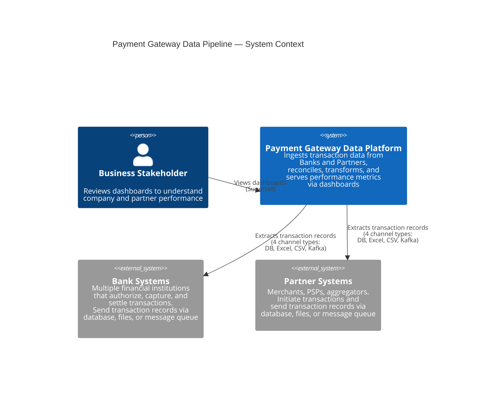
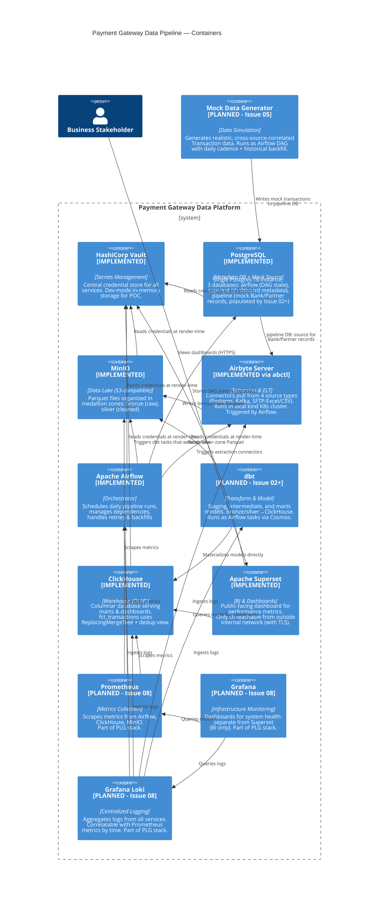

# Payment Gateway Data Pipeline — Architecture

## High-Level Concept

### The Problem

The Payment Gateway currently operates with a legacy crontab-based pipeline for reporting on company performance. Data arrives from multiple sources — Banks (the financial institutions processing transactions) and Partners (merchants/PSPs originating transactions) — through four different channels: direct database integration, Excel file drops, CSV file drops, and message queues. There is no reliable, trustworthy way to reconcile these disconnected sources and answer the fundamental business question: "How are we actually performing?" A Bank might report 10,000 transactions for the day while a Partner reports 9,950, and there's no automated way to determine whether that 50-transaction gap represents a real discrepancy, a delayed data arrival, or a duplicate-removal artifact.

This lack of a unified view creates operational blindness: nobody can confidently cite transaction volume, authorization rates, settlement rates, or revenue figures without manual reconciliation across systems. The current approach doesn't scale.

### The Solution

This POC builds a modernized, fully open-source data platform to replace the legacy pipeline. The architecture follows industry-standard patterns (medallion lake zones, dimensional modeling, batch orchestration) and combines purpose-built tools in each layer:

- **Extraction & orchestration**: dlt pipelines (ADR-0024, replacing Airbyte) extract data from all four source types as ordinary Airflow tasks; Apache Airflow schedules and orchestrates the daily run
- **Data lake**: Bronze (raw) and silver (cleaned) zones on MinIO (S3-compatible object storage), organized as Parquet files in a medallion structure
- **Transformation & warehouse**: dbt transforms bronze/silver data into ClickHouse, a columnar OLAP database optimized for dashboard queries
- **BI & insights**: Apache Superset provides dashboards showing transaction volume (Gross and Net), authorization rate, settlement rate, revenue, Bank/Partner comparisons, and decline-reason breakdowns
- **Secrets management**: HashiCorp Vault centralizes all service credentials with audit logging
- **Observability**: Prometheus, Grafana, and Loki provide infrastructure/metrics monitoring and centralized logging
- **Security**: Encryption at rest and in transit, PAN-masking validation, and selective network exposure

The result: a single source of truth for transaction performance, with the observability, security, and operational maturity expected of a payment-adjacent system—even at POC scale.

---

## C4 Model Architecture Diagrams

### System Context Diagram

The Payment Gateway Data Platform as a single system, with external actors and systems it integrates with:



### Container Diagram

All infrastructure services in the architecture, distinguished between **implemented** (Issue 01) and **planned** (Issues 02-10):



### Component Diagram (dbt Transformation Layer)

Detailed breakdown of the **planned** data transformation layer (Issues 02-07), showing how raw transaction data flows through staging, reconciliation, fee denormalization, and fact/dimension models:

```mermaid
C4Component
    title Payment Gateway Data Pipeline — dbt Components (PLANNED - Issues 02-07)

    Boundary(lake, "Data Lake (MinIO)") {
        Component(bronze, "Bronze Zone<br/>(Raw Parquet)", "Raw extract output from Airbyte<br/>4 sources: Bank DB, Partner DB,<br/>SFTP Excel/CSV, Kafka")
        Component(silver, "Silver Zone<br/>(Cleaned Parquet)", "Deduplicated, schema-validated,<br/>minimal transformations applied")
    }

    Boundary(dbt_layer, "dbt Transformation (Airflow Tasks via Cosmos)") {
        Component(stg_partner, "stg_partner_transactions", "Staging model<br/>Partner-side records from silver.<br/>Minimal cleanup.")
        Component(stg_bank, "stg_bank_transactions", "Staging model<br/>Bank-side records from silver.<br/>Minimal cleanup.")
        
        Component(int_reconcile, "int_bank_partner_reconciled", "Intermediate model<br/>FULL OUTER JOIN on gateway-assigned<br/>Transaction ID (ADR-0009, ADR-0012).<br/>Transaction visible as soon as<br/>either side reports it.")
        
        Component(int_fees, "int_with_applied_fees", "Intermediate model<br/>Adds Fee Schedule: fixed + % per<br/>Partner/Bank pair.<br/>Fee is calculated ONCE at capture time<br/>and denormalized to fact (ADR-0011).<br/>Never recomputed via live join.")
        
        Component(fct_table, "fct_transactions", "Fact table (RAW)<br/>Accumulating snapshot<br/>(one row per Transaction ID).<br/>Uses ClickHouse ReplacingMergeTree engine<br/>for merge-incremental strategy (ADR-0014).<br/>Columns: transaction_id, initiated_at,<br/>authorized_at, captured_at, settled_at,<br/>failed_at, refunded_at, partner_id,<br/>bank_id, fee_amount, etc.<br/>Transient duplicates before FINAL merge.")
        
        Component(fct_view, "fct_transactions_current", "Fact table (DEDUP VIEW)<br/>Selects latest version per transaction<br/>via argMax(timestamp, *).<br/>All downstream consumers point here,<br/>not the raw table (ADR-0014).<br/>No need for FINAL in queries.")
        
        Component(dim_date, "dim_date", "Dimension: Calendar<br/>Surrogate key (dim_date_key).<br/>Attributes: date, week_num, month,<br/>quarter, year, day_of_week, etc.<br/>Enables period-over-period comparison.")
        
        Component(dim_bank, "dim_bank", "Dimension: Banks<br/>Surrogate key (dim_bank_key).<br/>Natural key: bank_id.<br/>Attributes: name, processing_tier, etc.")
        
        Component(dim_partner, "dim_partner", "Dimension: Partners<br/>Surrogate key (dim_partner_key).<br/>Natural key: partner_id.<br/>Attributes: name, tier, country, etc.")
        
        Component(dim_decline, "dim_decline_reason", "Dimension: Decline Reasons<br/>Surrogate key (dim_decline_reason_key).<br/>Natural key: decline_reason_code.<br/>Attributes: description, category, etc.")
    }

    Boundary(warehouse, "ClickHouse (Warehouse)") {
        Component(ch_facts, "fct_transactions_current", "Materialized from<br/>dbt fact/view.<br/>Consumers never touch<br/>raw fct_transactions.")
        Component(ch_dates, "dim_date, dim_bank,<br/>dim_partner, dim_decline_reason", "Materialized from<br/>dbt dimensions.<br/>Shared across all<br/>Superset dashboards.")
    }

    Rel(bronze, stg_partner, "dbt reads")
    Rel(bronze, stg_bank, "dbt reads")
    Rel(silver, stg_partner, "dbt reads preferred")
    Rel(silver, stg_bank, "dbt reads preferred")
    Rel(stg_partner, int_reconcile, "FULL OUTER JOIN on<br/>transaction_id")
    Rel(stg_bank, int_reconcile, "FULL OUTER JOIN on<br/>transaction_id")
    Rel(int_reconcile, int_fees, "Adds fee calculation")
    Rel(int_fees, fct_table, "Materializes as<br/>ReplacingMergeTree")
    Rel(fct_table, fct_view, "argMax() deduplication")
    Rel(fct_view, ch_facts, "dbt materializes<br/>directly to ClickHouse<br/>(no gold Parquet)")
    Rel(dim_date, ch_dates, "dbt materializes")
    Rel(dim_bank, ch_dates, "dbt materializes")
    Rel(dim_partner, ch_dates, "dbt materializes")
    Rel(dim_decline, ch_dates, "dbt materializes")
```



---

## Module / Component Breakdown

### Implemented (Issue 01 — Infrastructure Bootstrap)

#### HashiCorp Vault (`vault` service)
- **Role**: Central credential storage with audit logging (ADR-0006)
- **Implementation**: Docker Compose service running in dev mode (in-memory storage)
- **What it holds**: Credentials for Postgres, MinIO, ClickHouse, Superset, Airflow (Fernet key)
- **How credentials are used**: A render-time pattern (not live runtime reads):
  1. `vault/seed-secrets.sh` writes initial secrets into Vault
  2. `scripts/render-env-from-vault.sh` reads secrets and generates `.env` file
  3. Docker Compose injects `.env` variables into each service at startup
- **Hazard**: Dev mode means in-memory storage; if Vault restarts unexpectedly, secrets are lost and you must reset all data volumes to match freshly-generated passwords (documented in README.md)

#### PostgreSQL (`postgres` service)
- **Role**: Metadata database for Airflow and Superset; also includes mock Bank/Partner source data
- **Implementation**: Single Postgres 16 instance with multiple databases
  - `airflow`: Airflow metadata (DAG runs, logs, connections)
  - `superset`: Superset dashboard definitions and metadata
  - `pipeline`: Will hold mock Bank-side and Partner-side transaction records (populated by Issue 02 mock generator)
- **Credentials**: Sourced from Vault
- **Volume**: `postgres-data` persists across restarts

#### MinIO (`minio` service)
- **Role**: S3-API-compatible object store for the data lake (ADR-0002, ADR-0003)
- **Implementation**: Docker Compose service with `minio-init` helper that creates the `data-lake` bucket on startup
- **Lake structure** (to be used by Issues 02+):
  - `data-lake/bronze/`: Raw Parquet files (4 channel types: bank-db, partner-db, sftp-files, kafka)
  - `data-lake/silver/`: Cleaned/deduplicated Parquet (minimal transformations)
  - No separate gold zone (ADR-0013: gold is ClickHouse, not Parquet)
- **Credentials**: Sourced from Vault
- **Partition strategy** (planned): By source and date, e.g., `bronze/source=bank_db/date=2024-11-01/`
- **Volume**: `minio-data` persists across restarts

#### Apache Airflow (`airflow-webserver`, `airflow-scheduler` services)
- **Role**: Orchestrator replacing legacy crontab (ADR-0004, user story #12)
- **Implementation**: Docker Compose with LocalExecutor (single-threaded, suitable for POC)
  - Webserver UI: `http://localhost:8080`
  - Scheduler: Triggered via Compose dependency ordering
- **Metadata backend**: Airflow Postgres database (credentials from Vault)
- **DAGs directory**: Mounted from `./airflow/dags` (empty placeholder in Issue 01)
- **What gets built in Issues 02+**:
  - `mock_data_producer`: Daily generator DAG (Issue 05)
  - `extraction`: Fan-out extraction tasks (one per source) triggering Airbyte (Issue 02+)
  - `dbt_run`: Cosmos-based dbt execution as Airflow tasks (Issue 02+)
  - Task failure callbacks routing to Teams alerts (Issue 08)
- **Credential access**: Via Vault at render time (no live Vault Agent integration in this POC)

#### ClickHouse (`clickhouse` service)
- **Role**: Columnar OLAP warehouse for fact and dimension tables (ADR-0004, ADR-0013)
- **Implementation**: Docker Compose service with default admin credentials sourced from Vault
- **Port mapping**: 8124:8123 (host:container) because port 8123 was occupied on this dev machine; 9002:9000 for native binary protocol
- **What gets built in Issues 02+**:
  - `fct_transactions`: Accumulating snapshot with ReplacingMergeTree engine, incremental merge strategy
  - `fct_transactions_current`: Dedup view using `argMax()` (all consumers point here)
  - `dim_bank`, `dim_partner`, `dim_decline_reason`, `dim_date`: Conformed dimensions with surrogate keys
- **Query patterns**: Optimized for dashboard analytics (GROUP BY, COUNT DISTINCT, SUM)
- **Volume**: `clickhouse-data` persists across restarts
- **Testing**: `dbt build` and `dbt test` run against a dev ClickHouse instance (future CI/CD gate)

#### Apache Superset (`superset`, `superset-init` services)
- **Role**: Business BI platform, the only UI reachable from outside the internal network (ADR-0016)
- **Implementation**: Docker Compose with custom Dockerfile (added psycopg2-binary for Postgres driver)
  - Dashboard UI: `http://localhost:8088`
  - Metadata backend: Superset Postgres database (credentials from Vault)
- **What gets built in Issues 02+**:
  - Dashboard: 1 chart in Issue 02 (transaction volume by day)
  - Dashboard extended in Issues 03-07 to cover all four performance pillars: Volume (Gross/Net), Authorization Rate, Settlement Rate, Revenue (Gross/Net), Bank/Partner comparison, Decline Reason breakdown, period comparisons
- **Network exposure** (planned Issue 09): HTTPS only, no default credentials, login rate limiting
- **Configuration file**: `superset/superset_config.py` (reads DATABASE_* env vars at startup)

#### dbt Project (`dbt/payment_gateway/`)
- **Role**: SQL-first transformation engine (ADR-0004)
- **Status in Issue 01**: Skeleton only—configured to target ClickHouse, no actual models yet
- **Files**:
  - `dbt_project.yml`: Project metadata, ClickHouse target config
  - `profiles.yml`: Connection profile for ClickHouse (credentials from Vault)
  - `models/`: Empty (to be filled in Issues 02+)
  - `seeds/`: Test fixtures (to be added for testing seam #1 in Issues 02+)
  - `tests/`: Data quality tests (to be added in Issue 07)
- **Execution in Airflow**: Via dbt-airflow-cosmos adapter (not yet integrated in Issue 01, planned Issue 02+)
- **Incremental strategy**: Merge with lookback window (ADR-0014), re-scanning 3-7 days of source data to catch late-arriving milestones

#### Airbyte (via `abctl` — local kind K8s cluster) — RETIRED by ADR-0024 / Issue 04

> Extraction now runs as dlt tasks inside the `daily_pipeline` DAG (`scripts/extract-to-bronze.py`); the kind cluster and all airbyte-* scripts were removed, and extraction credentials come from the Vault render like every other service. The subsection below is retained as historical Issue-01 context.

- **Status in Issue 01**: Infrastructure provisioned via `scripts/install-airbyte.sh`; no connectors configured yet
- **Deployment model** (ADR-0020): Runs in its own local `kind` Kubernetes cluster, not Docker Compose like other services
- **Connectors to be built in Issues 02+**:
  - Postgres CDC (Bank-side and Partner-side sources)
  - SFTP File (Excel/CSV drops)
  - Kafka (message queue drain)
- **Connection to orchestrator**: Triggered by Airflow `BashOperator` or similar (Issue 02+)
- **Secrets**: Managed within Airbyte's K8s cluster, independent of the Vault instance (accepted gap, ADR-0020, documented in README)

### Planned Infrastructure (Issues 08-10)

#### Prometheus (`prometheus` service)
- **Role**: Time-series metrics collection (ADR-0008)
- **Targets**: Airflow, ClickHouse, MinIO (all expose native Prometheus endpoints)
- **Scrape interval**: Typically 15-30s
- **Storage**: Local time-series database
- **Integration with Grafana**: As a datasource for dashboard visualization

#### Grafana (`grafana` service)
- **Role**: Infrastructure/system health dashboards (ADR-0008)
- **Separation from Superset**: Grafana stays operator-only (internal network); Superset is the public business BI layer
- **Dashboards** (to be built in Issue 08):
  - Airflow health (running DAGs, failed tasks, duration)
  - ClickHouse health (queries, memory, disk, replication lag if applicable)
  - MinIO health (object count, disk usage, request rates)
- **Alerting**: Via Alertmanager, routing Critical/Warning to Teams channels

#### Grafana Loki (`loki` service)
- **Role**: Centralized log aggregation and querying (ADR-0008)
- **Log sources**: Airflow, Airbyte, ClickHouse, dbt, MinIO
- **Query interface**: Native Loki queries in Grafana
- **Label cardinality**: Designed for high-cardinality labels (service, pod, task_id)
- **Retention**: Configurable (default typically 3-7 days for POC)

#### Teams Alerting Integration
- **Critical alerts** route to a dedicated Teams channel (extraction failed, dbt build failed, warehouse unreachable, dbt error-severity test failed)
- **Warning alerts** route to a separate channel (dbt warn-severity test, freshness nearing threshold, disk usage trending up)
- **Triggered by**: Prometheus/Alertmanager rules (infrastructure metrics) and Airflow task callbacks (pipeline failures)
- **Runbooks**: Short per-failure-mode runbooks linked from each alert message (no formal on-call training, so links are critical context)

---

## How the POC Works / Workflow

### End-to-End Data Flow (Fully Planned)

The daily batch pipeline follows this path:

```
Mock Data Generator (Issue 05)
  ↓ (produces correlated Bank/Partner records with shared Transaction IDs)
Mock Postgres DB + SFTP + Kafka
  ↓ (via 4 channel types)
Airbyte Connectors (Issues 02-04)
  ↓ (extracts via Postgres CDC, File, Kafka sources)
MinIO Bronze Zone (Raw Parquet)
  ↓ (basic cleanup: deduplication, schema validation)
MinIO Silver Zone (Cleaned Parquet)
  ↓ (dbt staging models read from here)
dbt Transformation Layer (Issues 02-07)
  ├─ stg_partner_transactions (staging)
  ├─ stg_bank_transactions (staging)
  ├─ int_bank_partner_reconciled (full outer join on Transaction ID)
  ├─ int_with_applied_fees (fee denormalization)
  ├─ fct_transactions (fact, ReplacingMergeTree)
  ├─ fct_transactions_current (dedup view via argMax)
  ├─ dim_bank, dim_partner, dim_decline_reason, dim_date (dimensions)
  └─ (all materialize directly to ClickHouse, no gold Parquet)
ClickHouse Warehouse
  ├─ fct_transactions_current (conformed fact)
  └─ dim_* (conformed dimensions)
Apache Superset Dashboards (Issue 06)
  └─ Business stakeholders review daily performance
```

### Implementation Phasing (10-Issue Backlog)

The full feature set is broken into vertical slices with explicit dependencies:

| Issue | Title | Scope | Depends On | Status |
|-------|-------|-------|-----------|--------|
| **01** | **Infra bootstrap** | Docker Compose stack + Vault secrets + dbt skeleton | — | **✓ DONE** |
| 02 | Walking skeleton | Single source (Partner DB) → bronze/silver/staging/minimal fact → 1 chart | 01 | Planned |
| 03 | Bank reconciliation + fees | Add Bank source, full outer join, fee-at-capture denormalization, Auth/Settlement rates | 02 | Planned |
| 04 | Remaining sources | SFTP Excel/CSV + Kafka connectors, incorporate into reconciliation | 03 | Planned |
| 05 | Full mock generator | Scheduled DAG, 30-90 day backfill, catalog of Banks/Partners, anomalies, reset capability | 04 | Planned |
| 06 | Dimensions + dashboard | dim_date/bank/partner/decline_reason, full performance dashboard (volume, rates, revenue, comparisons) | 05 | Planned |
| 07 | Data quality | dbt tests (not_null, unique, relationships, accepted_values), source freshness checks | 06 | Planned |
| 08 | Observability | Prometheus + Grafana + Loki, Teams alerting, runbooks | 01 (parallel) | Planned |
| 09 | Security hardening | PAN-masking validation, encryption at rest/in transit, Superset public exposure with TLS/rate-limiting | 01 (parallel) | Planned |
| 10 | CI/CD + backups + schema drift | CI pipeline (lint DAGs, dbt build/test, required PR review), daily backups (MinIO/CH/Airflow/Vault), fail-loud schema drift | 01 (parallel) | Planned |

**Parallelization**: Issues 08, 09, 10 have no dependencies on the payment-domain logic (02-07), so they can start immediately after 01 completes. This allows infrastructure hardening, observability, and CI/CD setup to proceed independently from the feature-slice work.

### Service Health & Verification

Bring-up order matters due to credential dependencies:

1. **Start Vault** (all other services depend on its secrets):
   ```bash
   docker compose up -d vault
   ```

2. **Seed Vault** with credentials (only once):
   ```bash
   ./vault/seed-secrets.sh
   ```

3. **Render `.env`** file from Vault (render-time pattern, not live runtime reads):
   ```bash
   ./scripts/render-env-from-vault.sh
   ```

4. **Bring up remaining services**:
   ```bash
   docker compose up -d
   ```

Or, more simply, run the all-in-one verification script:
```bash
./scripts/verify-full-stack.sh
```

This script:
- Starts Vault and waits for it to be healthy
- Seeds it with initial secrets (idempotent)
- Renders `.env`
- Brings up all services
- Runs per-service health checks (Vault, Postgres, MinIO, Airflow, ClickHouse, Superset, Airbyte)
- Verifies dbt `debug` succeeds

### Operational Runbook (Refer to README.md for Details)

The `README.md` file documents:
- Bring-up order and dependency graph
- Vault dev-mode restart hazard and recovery (if Vault restarts unexpectedly, reset volumes and re-run verification)
- Credential sourcing model (render-time `.env`, not live Vault Agent)
- Airbyte's credential independence (managed in its own K8s cluster, not via the shared Vault)
- Service port mappings and health endpoints

For operational details, bring-up procedures, and troubleshooting, **refer to `README.md`**. This document is about architecture and reasoning; the README is the runbook.

---

## Key Architecture Decisions and Their Rationale

This architecture is the downstream of 20 ADRs (Architectural Decision Records) in `docs/adr/`. Key decisions include:

- **ADR-0001**: Batch pipeline (daily), not streaming—the message-queue source is periodically drained, not continuously consumed
- **ADR-0002 (amended 0020)**: Self-hosted on-prem via Docker Compose + Airbyte via abctl K8s—no cloud lock-in
- **ADR-0003**: Parquet medallion lake (bronze/silver), no lakehouse table format (Iceberg/Delta)—simpler ops burden at POC scale
- **ADR-0004**: Core OSS stack—Airflow, Airbyte, dbt, ClickHouse, Superset—each layer uses industry-standard tooling
- **ADR-0005**: Current-state-only warehouse, no Type 2 SCD history—upsert all records to latest version
- **ADR-0006**: HashiCorp Vault for centralized credential management with audit logging
- **ADR-0007**: Conformed dimensional model (single set of shared dimensions), not per-dashboard denormalization
- **ADR-0008**: Prometheus + Grafana + Loki (PLG stack) for observability; dbt tests + source freshness for data monitoring
- **ADR-0009**: Gateway-assigned Transaction ID for clean reconciliation (no fuzzy matching)
- **ADR-0010**: Custom Python mock generator with realistic cross-source correlation, daily scheduled, anomalies injected for testing
- **ADR-0011**: Fee Schedule denormalized onto the fact row (calculated once at capture, never recomputed)
- **ADR-0012**: Full outer join reconciliation—a transaction visible as soon as either side reports, with nulls on the unreported side
- **ADR-0013**: Gold is ClickHouse (no separate gold Parquet zone)—fewer copies of truth means less drift
- **ADR-0014**: Incremental merge with lookback window—re-scan 3-7 days to catch late-arriving milestones
- **ADR-0015**: Never store raw PAN or bank account numbers—sources must send masked/tokenized only
- **ADR-0016**: Superset publicly exposed (with TLS/no defaults/rate-limiting); Airflow/Grafana/MinIO internal-only
- **ADR-0017**: Encryption at rest (MinIO, ClickHouse volumes) and in transit (TLS between services)
- **ADR-0018**: Daily backups (~24h RPO) of MinIO, ClickHouse, Airflow metadata, Vault—separate from host
- **ADR-0019**: Fail loudly on schema drift—unreviewed schema changes don't silently propagate
- **ADR-0020**: Airbyte deployed via abctl (local kind K8s)—uses Airbyte's own supported deployment path

For full context and reasoning on each decision, refer to the ADRs in `docs/adr/`.

---

## Domain Vocabulary

All code, issues, and documentation use the domain terms defined in `CONTEXT.md`:

- **Transaction**: A payment attempt with a fixed lifecycle (initiated → authorized → captured → settled, plus failed/refunded branches). Exactly one Bank and one Partner per transaction.
- **Bank**: The financial institution that authorizes/settles funds (the processing rail).
- **Partner**: The upstream entity (merchant, PSP, aggregator) that originates the transaction.
- **Authorization Rate**: % of initiated transactions reaching the authorized state.
- **Settlement Rate**: % of authorized transactions reaching the settled state (distinct from authorization rate).
- **Fee Schedule**: Pricing per Partner/Bank pair (fixed + percentage).
- **Gross vs. Net Volume/Revenue**: Gross before refunds; Net after. Net is the headline figure.
- **Decline Reason**: Categorized cause (insufficient_funds, fraud_suspected, technical_error, invalid_account, etc.) for declined/failed transactions.
- **Critical alert**: Extraction failed, dbt build failed entirely, warehouse unreachable, or dbt error-severity test failed.
- **Warning alert**: Everything else non-blocking (dbt warn-severity test, freshness check nearing, resource usage trending up).

Use these terms consistently across code, issues, and documentation. Refer to `CONTEXT.md` for the full glossary and terms to avoid.

---

## Current Implementation Status

**Issue 01 (Infra Bootstrap) is complete and code-reviewed.**

- ✓ Docker Compose stack running (Vault, Postgres, MinIO, Airflow, ClickHouse, Superset)
- ✓ Vault initialized and seeding all service credentials
- ✓ dbt project skeleton configured for ClickHouse target
- ✓ Airbyte infrastructure installed via abctl
- ✓ All services reachable and healthy

**Issues 02-10 are planned but not yet built.** There are no DAGs, no dbt models, no dashboards, and no observability/security/CI infrastructure. These issues build out the full feature set in deliberate, testable vertical slices.

---

## Architecture Diagram Summary

```
[Business Stakeholder] 
         ↓ (HTTPS)
    [Superset Dashboard]
         ↓ (SQL queries)
    [ClickHouse Warehouse]
         ↑ (dbt materializes)
    [dbt Transformation] ← reads from
         ↑
    [MinIO Lake] ← populated by
         ↑
    [Airbyte Connectors] ← triggered by
         ↑
    [Airflow Orchestrator] ← pulls secrets from
         ↑
    [HashiCorp Vault]
         ↑
   [4 Source Types]
  Bank DB, Partner DB,
   SFTP Files, Kafka
```

In parallel:
- **Observability**: Prometheus scrapes metrics → Grafana visualizes → Loki aggregates logs → Alertmanager routes to Teams
- **Security**: Encryption at rest (MinIO, ClickHouse), TLS in transit, PAN validation, Superset public exposure hardened
- **Reliability**: CI/CD (lint DAGs, dbt build/test), daily backups (MinIO, ClickHouse, Airflow metadata, Vault), schema drift alerts

---

## For More Information

- **Full requirements**: `.scratch/payment-gateway-pipeline/PRD.md`
- **Domain glossary**: `CONTEXT.md`
- **Architectural decisions**: `docs/adr/` (20 ADRs, 0001-0020)
- **Implementation backlog**: `.scratch/payment-gateway-pipeline/issues/` (10 issues, 01-10)
- **Operational runbook**: `README.md` (bring-up, credential sourcing, Vault hazards)
- **dbt project**: `dbt/payment_gateway/` (skeleton in Issue 01, models in Issues 02-07)
- **Infrastructure code**: `docker-compose.yml`, `vault/seed-secrets.sh`, `scripts/`
